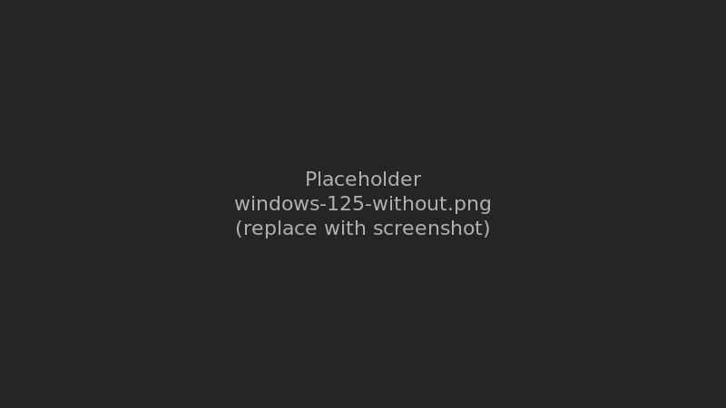
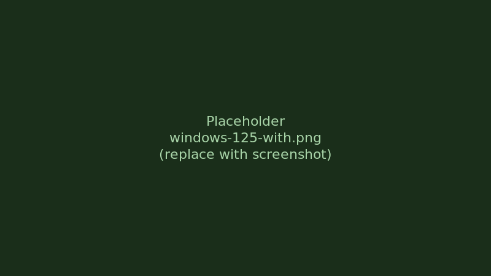

# next-app-scaler

---

### English

A **scaled sandbox** for Next.js apps—especially **shadcn/ui**—so layouts stay coherent on **Windows / Linux** when the OS uses **display zoom** (125%, 150%, …) and the browser reports `devicePixelRatio > 1`.

When the sandbox is **on**, it helps the UI **look and behave correctly** by bringing the **visual** result closer to a consistent **100%-scale** layout (scroll, overflow, Radix portaled content). **Recommendation:** design and tweak your UI with **Windows display scaling at 100%** (or whatever you ship for). If you **always** develop at **125% or 150%** system zoom, you may have sized spacing and type for that environment—with the scaler active, the same app can feel **smaller** than on your normal desktop, because the package is **undoing** that extra zoom for layout—not because the library is “wrong,” but because you were previewing at a larger effective scale before.

Published on npm: [`next-app-scaler`](https://www.npmjs.com/package/next-app-scaler).

### Español

Un **sandbox escalado** para apps Next.js—sobre todo con **shadcn/ui**—para que el layout se mantenga coherente en **Windows / Linux** cuando el sistema usa **zoom de pantalla** (125%, 150%, …) y el navegador reporta `devicePixelRatio > 1`.

Con el sandbox **activo**, ayuda a que la UI **se vea y comporte bien**, acercando el resultado **visual** a un aspecto coherente tipo **100%** (scroll, desbordes, contenido en portales de Radix). **Recomendación:** programa y ajusta la UI con **escala de pantalla de Windows al 100%** (o la que quieras como referencia real). Si trabajas siempre al **125% o 150%**, es fácil haber calibrado tipografía y márgenes “a ojo” para ese entorno: al usar el paquete puede parecer que todo queda **más pequeño** que en tu día a día, porque el escalado **compensa** ese zoom extra del sistema—no es un fallo del paquete, es el contraste con haber diseñado viendo la UI “más grande” por el zoom de pantalla.

Publicado en npm: [`next-app-scaler`](https://www.npmjs.com/package/next-app-scaler).

### Example · Ejemplo — Windows display zoom (with vs without)

| Without `next-app-scaler` | With `next-app-scaler` |
|:-:|:-:|
|  |  |

*EN: Same browser width and page; only the scaler differs. ES: Mismo ancho y misma vista; solo cambia el scaler. — Add PNGs in [`docs/images/`](./docs/images/README.md).*

---

## English

### Install

```bash
npm install next-app-scaler
```

### Usage

#### 1. Patch shadcn primitives (portals)

From the **root of your Next.js app**:

```bash
npx next-app-scaler
```

This scans `src/components/ui/*` and, where it finds Radix **Portal** primitives (`Dialog`, `Sheet`, `Select`, `Tooltip`, etc.), it:

- adds `import { useScaler } from "next-app-scaler"`;
- injects `const { scalerRef } = useScaler()` inside the component;
- sets `container={scalerRef.current}` on the Portal so overlays render **inside** the same transformed root as your app (otherwise `position: fixed` breaks under a transformed ancestor).

**Re-run** after adding new Radix-based UI files, or if you regenerate components from shadcn and lose the patch.

#### 2. Wrap the app

In `src/app/layout.tsx`, inside `<body>`:

```tsx
import { AppScaler } from "next-app-scaler";

export default function RootLayout({ children }: { children: React.ReactNode }) {
  return (
    <html lang="en">
      <body>
        <AppScaler>{children}</AppScaler>
      </body>
    </html>
  );
}
```

Optional: pass **`className`** for Safari / safe-area tweaks, e.g. `<AppScaler className="pb-[env(safe-area-inset-bottom)]">`.

#### 3. Optional: `useScaler()` in your code

```tsx
import { useScaler } from "next-app-scaler";

const { scalerRef, scale, isActive } = useScaler();
```

- **`scale`**: CSS scale factor when active (e.g. `0.8` at 125% zoom).
- **`isActive`**: `true` when the HiDPI sandbox is on (desktop Windows/Linux by default; not mobile / not macOS in the default logic).

The root element also exposes `data-app-scaler-active` and `data-app-scaler-scale` for CSS or tests.

### How it works (short)

| Environment | Behavior |
|-------------|----------|
| **Mobile** | Scaling **off** (`position: relative`, no transform). |
| **macOS** | Scaling **off** — Retina is handled differently; we avoid double scaling. |
| **Windows / Linux desktop** with `devicePixelRatio > 1` | **On**: root uses `position: fixed`, `transform: scale(1/DPR)`, and width/height **> 100%** so the **visual** size matches the viewport. `document.body` overflow is hidden; scroll lives inside the scaler root. |

Runtime updates also listen to **`window.resize`** and, when available, **`visualViewport.resize`**, so page zoom / odd viewport changes still re-run the same layout logic. That does **not** change the `scale(1/DPR)` math—only how often it refreshes.

> **Note:** Older docs mentioned a special “100dvh Mac shell”; the current code simply **disables** the scaler on Mac. The root still uses **`min-h-svh`** + **`h-dvh`** (full-height column); tweak with **`className`** on **`AppScaler`** if Safari needs more.

### Mac, Safari, or mobile — layout looks “off”?

We **do not** turn on the Windows-style `transform` on Mac by default: Retina usually has `devicePixelRatio === 2`, and scaling like Windows would **shrink** the whole app. If something looks wrong on your spouse’s Mac, it’s usually:

1. **Portals** — Run **`npx next-app-scaler`** so overlays aren’t stuck on `document.body`.
2. **Safari + `dvh`** — Toolbars and safe areas; override with **`className`** on **`AppScaler`** (e.g. safe-area padding or your own `min-h-*`).
3. **Flex** — Children may need **`min-h-0`** so scroll regions behave (see [LAYOUT-PITFALLS](./docs/LAYOUT-PITFALLS.md)).

### Does `npx next-app-scaler` need updating when the library updates?

**Usually no.** The CLI only wires **portals** to `scalerRef` from `useScaler()`. Newer runtime work (e.g. `visualViewport`, compositor hints) lives inside **`AppScaler`** and keeps the same ref and behavior for overlays. You only need to **re-run the CLI** if you add or regenerate UI components that use new Portals, or if upstream shadcn changes file structure so the patch no longer matches.

### Docs for integrators

| Doc | Purpose |
|-----|---------|
| [docs/LAYOUT-PITFALLS.md](./docs/LAYOUT-PITFALLS.md) | `dvh` vs `%`, portals, z-index, full-screen pages |
| [docs/AI-ASSISTANT-PROMPT.md](./docs/AI-ASSISTANT-PROMPT.md) | Copy-paste prompts for AI-assisted debugging |

### Local development (maintainers)

Clone this package’s repo, then `npm install`, edit `src/index.tsx`, `npm run build`. To test in an app without publishing, use `npm link` or `npm pack` and install the tarball. Consumer apps only depend on the npm package—they don’t ship this source tree.

### Author · License

**sancheznotdev** ❤️ · [GitHub](https://github.com/sancheznot/)

*Made with care — real desks, real zoom, fewer “dialogs in the wrong place.”*

MIT License

---

## Español

### Instalación

```bash
npm install next-app-scaler
```

### Uso

#### 1. Parchear primitivas de shadcn (portales)

Desde la **raíz de tu app Next.js**:

```bash
npx next-app-scaler
```

El comando revisa `src/components/ui/*` y, donde encuentra **Portal** de Radix (`Dialog`, `Sheet`, `Select`, `Tooltip`, etc.):

- añade `import { useScaler } from "next-app-scaler"`;
- inyecta `const { scalerRef } = useScaler()` dentro del componente;
- pone `container={scalerRef.current}` en el Portal para que los overlays se rendericen **dentro** del mismo nodo transformado que la app (si no, `position: fixed` se comporta mal bajo un ancestro con `transform`).

**Vuelve a ejecutarlo** si añades nuevos componentes basados en Radix, o si regeneras archivos desde shadcn y se pierde el parche.

#### 2. Envolver la app

En `src/app/layout.tsx`, dentro de `<body>`:

```tsx
import { AppScaler } from "next-app-scaler";

export default function RootLayout({ children }: { children: React.ReactNode }) {
  return (
    <html lang="es">
      <body>
        <AppScaler>{children}</AppScaler>
      </body>
    </html>
  );
}
```

Opcional: **`className`** para Safari / safe area, p. ej. `<AppScaler className="pb-[env(safe-area-inset-bottom)]">`.

#### 3. Opcional: `useScaler()` en tu código

```tsx
import { useScaler } from "next-app-scaler";

const { scalerRef, scale, isActive } = useScaler();
```

- **`scale`**: factor CSS cuando está activo (p. ej. `0.8` con zoom 125%).
- **`isActive`**: `true` cuando el sandbox HiDPI está encendido (Windows/Linux de escritorio por defecto; no móvil / no macOS con la lógica por defecto).

El nodo raíz también expone `data-app-scaler-active` y `data-app-scaler-scale` para CSS o tests.

### Cómo funciona (resumen)

| Entorno | Comportamiento |
|---------|----------------|
| **Móvil** | Escalado **apagado** (`position: relative`, sin `transform`). |
| **macOS** | Escalado **apagado** — Retina se gestiona distinto; evitamos doble escalado. |
| **Windows / Linux** con `devicePixelRatio > 1` | **Encendido**: raíz con `position: fixed`, `transform: scale(1/DPR)` y ancho/alto **> 100%** para que el tamaño **visual** coincida con el viewport. Scroll dentro del root del scaler; `overflow` del `body` controlado. |

En tiempo de ejecución también se escuchan **`window.resize`** y, si existe, **`visualViewport.resize`**, para que zoom de página o cambios raros de viewport vuelvan a ejecutar la misma lógica. Eso **no** cambia la fórmula `scale(1/DPR)`—solo **cuántas veces** se actualiza.

> **Nota:** documentación antigua hablaba de un “shell Mac 100dvh” especial; la implementación actual **desactiva** el scaler en Mac. El root usa **`min-h-svh`** + **`h-dvh`**; si Safari se porta mal, ajusta con **`className`** en **`AppScaler`**.

### Mac, Safari o móvil — ¿se ve raro?

**No** activamos el `transform` estilo Windows en Mac por defecto: en Retina suele haber `devicePixelRatio === 2` y escalar como en Windows **encogería** toda la UI. Si en un Mac “se ve mal”, lo habitual es:

1. **Portales** — Ejecuta **`npx next-app-scaler`** para que los overlays no queden solo en `document.body`.
2. **Safari y `dvh`** — Barra de URL y safe area; pasa **`className`** a **`AppScaler`** (p. ej. padding safe-area o tu propio `min-h-*`).
3. **Flex** — A los hijos a veces les falta **`min-h-0`** para el scroll (ver [LAYOUT-PITFALLS](./docs/LAYOUT-PITFALLS.md)).

### ¿Hay que actualizar el parche (`npx`) cuando sube la librería?

**Por lo general, no.** El CLI solo conecta los **portales** a `scalerRef` de `useScaler()`. Las mejoras de runtime (p. ej. `visualViewport`, hints de compositor) viven en **`AppScaler`** y mantienen el mismo ref y el mismo contrato para overlays. Solo necesitas **volver a ejecutar el CLI** si añades o regeneras componentes con portales nuevos, o si shadcn cambia la estructura de archivos y el parche ya no coincide.

### Documentación para quien integra

| Doc | Para qué |
|-----|----------|
| [docs/LAYOUT-PITFALLS.md](./docs/LAYOUT-PITFALLS.md) | `dvh` vs `%`, portales, z-index, pantallas a pantalla completa |
| [docs/AI-ASSISTANT-PROMPT.md](./docs/AI-ASSISTANT-PROMPT.md) | Prompts listos para depurar con IA |

### Desarrollo local (mantenedores)

Clona el repo de este paquete, `npm install`, edita `src/index.tsx`, `npm run build`. Para probar en una app sin publicar: `npm link` o `npm pack` e instala el `.tgz`. Las apps consumidoras solo declaran la dependencia npm; no incluyen este árbol fuente.

### Autor · Licencia

**sancheznotdev** ❤️ · [GitHub](https://github.com/sancheznot/)

*Hecho con mucho cariño — escritorios de verdad, zoom real, menos diálogos fuera de sitio.*

Licencia MIT
